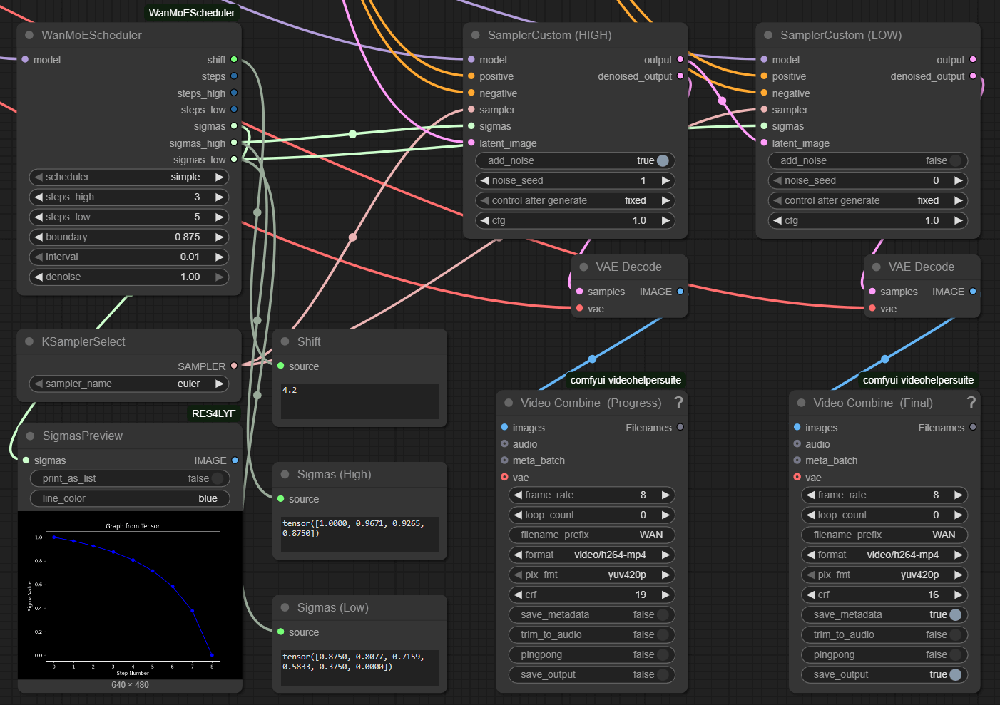
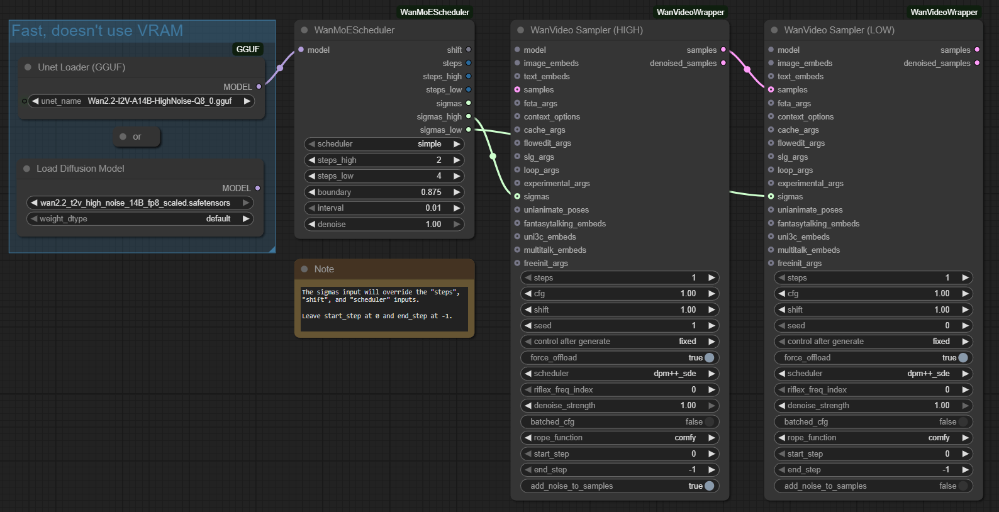
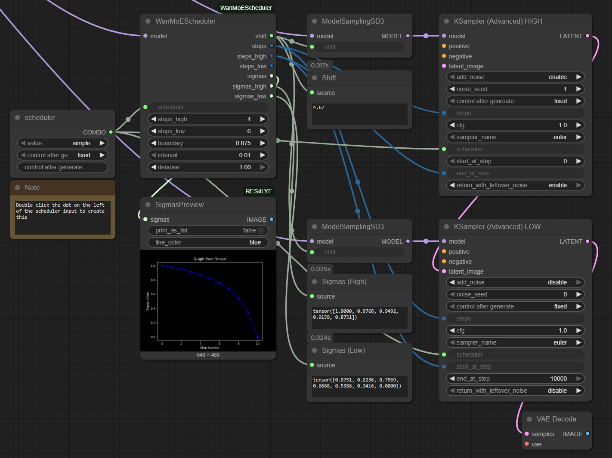

# ComfyUI-WanMoEScheduler

A ComfyUI scheduler that automatically finds the optimal `shift` value to align your high and low sampling steps with a target sigma boundary. This eliminates the guesswork and manual calculations, and allows for precise control of the transition step.

## Core Sampling Concepts Explained

### What are Sigmas?
**Sigmas** (σ) represent the level of noise in the image during the diffusion process. A high sigma value means there is a lot of noise (early in the sampling process), while a low sigma value means there is little noise (late in the sampling process). A scheduler generates a sequence of sigma values to guide the model from a noisy state to a clean image.

### What is a Boundary?
The **boundary** is a specific sigma value that acts as a threshold between the high-noise and low-noise stages of your workflow. It determines where the initial high-noise stage ends and the low-noise stage begins.

For example:
*   A boundary of `0.875` means that any sampling step with a sigma value greater than or equal to `0.875` is considered part of the "high-noise" stage. Steps with a sigma less than `0.875` are in the "low-noise" stage.
*   WAN models, for instance, typically use a boundary of `0.90` for Image-to-Video (I2V) tasks and `0.875` for Text-to-Video (T2V) tasks.

### The Shift Problem
Many schedulers include a **shift** parameter that pushes the entire sigma distribution higher or lower. Finding the correct shift value is crucial for aligning the boundary with your desired number of steps:
*   **Too low:** The boundary may fall in the wrong place, giving you an incorrect number of high or low steps.
*   **Too high:** You might waste steps or experience a drop in quality.
*   **Manual calculation:** Finding the right shift value often requires complex math or tedious trial and error.

This node solves the shift problem by automating the calculations.

## Features

- **Automatic Shift Calculation**: Automatically finds the optimal `shift` value to hit your target sigma boundary.
- **Flexible Step Control**: Use any combination of high and low steps without worrying about manual calculations.
- **Multi-Stage Outputs**: Provides separate sigma sequences for high-noise and low-noise sampling stages.
- **Broad Sampler Compatibility**: Works with most ComfyUI samplers.
- **Smart Scheduler Filtering**: Automatically excludes schedulers where the `shift` parameter has a minimal or no effect.
- **Denoise Support**: Fully compatible with partial denoising workflows.

## Installation

### Via ComfyUI Manager (Recommended)
1.  Open **ComfyUI Manager**.
2.  Search for "**ComfyUI-WanMoEScheduler**".
3.  Click **Install**.

### Manual Installation
1.  Navigate to your ComfyUI `custom_nodes` directory:
    ```bash
    cd ComfyUI/custom_nodes
    ```
2.  Clone this repository:
    ```bash
    git clone https://github.com/cmeka/ComfyUI-WanMoEScheduler.git
    ```
3. Restart ComfyUI.

## Usage

### Key Benefits

The **WanMoEScheduler** node simplifies experimenting with different step counts, allowing you to balance speed and quality effortlessly:

- **Speed vs. Quality**: Quickly test configurations like 4 high steps for speed and 10 low steps for quality.
- **Experiment Freely**: Try any combination of steps (e.g., 4+4, 2+10, 8+6) without needing to recalculate the shift value.
- **Automatic Optimization**: The node handles the complex calculations to find the perfect shift for your setup.

### Node Overview

The **WanMoEScheduler** provides advanced sigma calculation for two-stage sampling workflows.

#### Input Parameters

- **`model`**: The model used for sigma calculations.
- **`scheduler`**: The sampling scheduler to use (the list is filtered to show only compatible schedulers).
- **`steps_high`**: The desired number of steps for the high-noise sampling stage (default: 4).
- **`steps_low`**: The desired number of steps for the low-noise sampling stage (default: 4).
- **`denoise`**: The amount of noise to remove, from 0.0 (no change) to 1.0 (full denoise) (default: 1.0).
- **`boundary`**: The target sigma value to separate the high and low stages (default: 0.875).
- **`interval`**: The step size for the shift search algorithm. A smaller value is more precise but slower (default: 0.01).

#### Output Parameters

- **`shift`**: The calculated optimal shift value.
- **`sigmas`**: The complete sigma sequence for all steps.
- **`sigmas_high`**: The sigma sequence for the high-noise steps.
- **`sigmas_low`**: The sigma sequence for the low-noise steps.
- **`steps_total`**: The total number of sampling steps (`steps_high` + `steps_low`).
- **`steps_high`**: The number of high-noise steps (passthrough).
- **`steps_low`**: The number of low-noise steps (passthrough).

### Recommended Settings

#### For WAN Models
- **Image-to-Video (I2V)**: `boundary` of `0.90` to `0.93`.
- **Text-to-Video (T2V)**: `boundary` of `0.875`.

#### General Tips
- Use **`interval`**: `0.01` for high precision (slightly slower) or `0.1` for faster calculations (less precise).
- If using speed-enhancing LoRAs, you may need to lower their strength when increasing the number of `steps_low`.
- The default `boundary` of `0.875` is a good starting point for many general workflows.

## Workflow Integration

There are two primary ways to use this node's outputs: by feeding the `sigmas` directly into a custom sampler or by using the `shift` and `steps` with advanced KSamplers.

### Method 1: Using `sigmas` (for Custom Samplers)

1.  Connect your model to the **WanMoEScheduler** node.
2.  Route the **`sigmas_high`** output to your first sampler (high-noise pass).
3.  Route the **`sigmas_low`** output to your second sampler (low-noise pass).
4.  Apply any stage-specific conditioning or LoRAs as needed.

#### Method 1 Example (ComfyUI Core)


#### Method 1 Example (WanVideoWrapper)


#### For More Than Two Stages
You can further divide the sampling process. For example, to split the high-noise stage:
1.  Follow the steps above.
2.  Connect the **`sigmas_high`** output to a `SplitSigmas` node.
3.  Set the `step` parameter on the `SplitSigmas` node to your desired split point. This will give you two separate sigma sequences from the original high-noise portion.

### Method 2: Using `shift` and `steps` (with Advanced KSamplers)

This method is common for standard two-pass workflows.

1.  Connect your model to the **WanMoEScheduler** node.
2.  Connect the **`shift`** output to the **ModelSamplingSD3** nodes (high and low)
3.  In your **first KSampler (Advanced)** node (for the high-noise stage):
    - Connect **`steps_total`** to the `steps` input.
    - Connect **`steps_high`** to the `end_at_step` input.
4.  In your **second KSampler (Advanced)** node (for the low-noise stage):
    - Connect **`steps_total`** to the `steps` input.
    - Connect **`steps_high`** to the `start_at_step` input.
5.  **Important**: Ensure the `scheduler` selected in **WanMoEScheduler** is the same one selected in your **KSampler (Advanced)** nodes.

#### Method 2 Example (ComfyUI Core)


#### For More Than Two Stages
1.  Follow the steps above.
2.  Connect **steps_high** to **end_at_step** of the **2nd stage high noise KSampler (Advanced)** node.

## Technical Details

### Supported Schedulers

The node automatically filters the scheduler list to include only those that are significantly affected by the `shift` parameter.
- **Excluded**: `karras`, `exponential`, `linear_quadratic`, `kl_optimal`, `bong_tangent`
- **Included**: All other standard ComfyUI schedulers.

### Performance
- **Search Time**: The time it takes to find the optimal shift is proportional to the `interval` value. A smaller interval is more precise but takes longer.

## Troubleshooting

**"Could not find shift" Error**
- **Decrease the `interval`**: A smaller interval may help find a valid shift value if the search space is narrow.
- **Check the `boundary`**: Your target boundary might be too high or low to be achievable with the given step counts. Try a value in the `0.875` to `0.93` range.
- **Verify Model Compatibility**: Ensure the selected model and scheduler work together as expected.

**Poor Quality Results**
- **Adjust `boundary`**: Experiment with different boundary values. The optimal value can depend on the model and desired outcome.
- **Change Step Ratios**: Try different combinations of `steps_high` and `steps_low`.
- **Tune LoRA Strength**: If using speed LoRAs, their strength may need to be adjusted to match the number of steps in each stage.